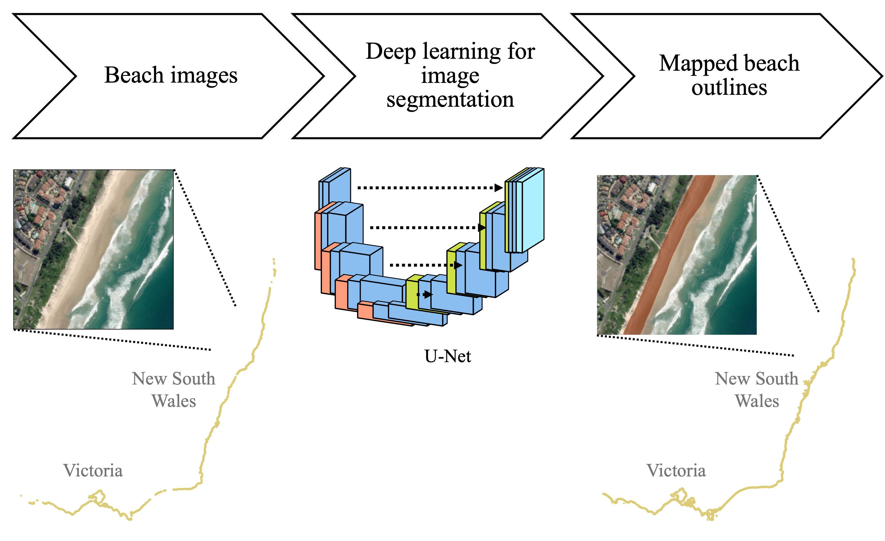

# Mapping Sandy Beaches using Deep Learning

<p align="center">
  
</p>

Mapping Australian sandy beaches using image segmentation deep learning method based on U-Net architecture.

## Installation
```
git clone https://bitbucket.csiro.au/scm/~yon012/sandybeachmapping_dl.git
pip install -r requirements.txt
```

## Quick Start

Download data: See [Spatial processing and downloading of data](#spatial-processing-and-downloading-of-data)

Run deep learning pipeline:

0. Setup configs: `config/config.yaml`
1. Run training: `$ python -m sandybeachmapping_dl.main`
2. Run evaluation: `$ python -m sandybeachmapping_dl.main --config-name='config_eval.yaml'`


## Usage

### Data folder layout and filename convention
- Folder: `<data_dir>`
- Filename convention: `<IMAGE_SOURCE>_<AUS_STATE>_<IMAGE_TYPE>_FID.tif`
  - `<IMAGE_SOURCE>`: Image source, e.g., from Bing
  - `<AUS_STATE>`: Australian state
  - `<IMAGE_TYPE>`: Either `image`, `mask`, or `maskpred`

### Spatial processing and downloading of data
{R} scripts to tile and download images for input into {python} ML code, and then convert ML raster output to polygon vectors are found in the folder `coast_tiling_extraction`. The extraction scripts can be run for each Australian State (e.g. VIC).

0. *Not used* `download_and_Tile_beach_images.R` tile the region of a OSM beach into n x m tiles covering the entire  OSM beach id polygon.
1. `tile_beach_images.R` define 512 x 512 image tiles along the coastline of a Australian state (e.g. VIC). The tiles overlap, but tiles with more than 5 overlaps are removed (rs > thr).
2. `download_tile_images.R` download the aerial images for each 512 x 512 tile in previous step.
3. `mask_tile_images.R` rasterise the binary "mask" of the OSM beach polygons for each image tile in the previous step.
   - *Not used* `mask_tile_images_BeachCliffsSea.R` make a classified mask to include a cliff and beach mask.
4. `polygonise_ml_output_maskpred.R` convert the ML output rasters to polygon vectors, to compare to OSM beaches.

### Output files from main script
- Select test set to evaluate in configs: `test_imageset`
  - `mask`: Test images with masks
  - `mask+nomask`: Test images with masks and images without masks
  - `all`: All images, including from training, validation and testing. Outputs will be in `<maskpred_subdir>_all`.
- `<output_dir>/<maskpred_subdir>/`: GeoTiff of predicted masks
- `<output_dir>/<maskpred_subdir>_polygons.shp.zip`: Shapefile of predicted masks
- In `<modelout_dir>/`:
  - `model.pth`: Trained model
  - `loss_metric.pkl`: Loss metrics


## Authors
Suk Yee Yong (sukyee.yong@csiro.au)  
Julian O'Grady (julian.ogrady@csiro.au)

## About
This project is being developed as part of Scientific Computing Collaboration Project 2024H1 for [ERRFP 1343: Machine Learning Methods to Identify Australian Beaches from a Citizen Science derived training data](https://confluence.csiro.au/display/SCinternal/ERRFP-1343).

## Acknowledgements
Dataset of [OpenStreetMap](https://www.openstreetmap.org/) (OSM) beaches is created using overpass API.  
Open source packages used: [PyTorch](https://github.com/pytorch/pytorch), [SMP](https://github.com/qubvel/segmentation_models.pytorch), [terra](https://github.com/rspatial/terra)

## Citation
If you find this repository useful, please cite the paper:
```bibtex
@article{yong2024sandybeachmappingdl,
  author = {Yong, Suk Yee and O'Grady, Julian and Gregory, Rebecca and Lynton, Dylan},
  doi = {10.3390/rs16183534},
  issn = {2072-4292},
  journal = {Remote Sensing},
  number = {18},
  title = {Regional-Scale Image Segmentation of Sandy Beaches in Southeastern Australia},
  url = {https://www.mdpi.com/2072-4292/16/18/3534},
  volume = {16},
  article-number = {3534},
  year = {2024},
}
```

## License
[CSIRO Open Source Software Licence Agreement (variation of the BSD / MIT License)](LICENSE.md)
